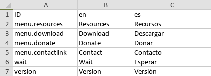
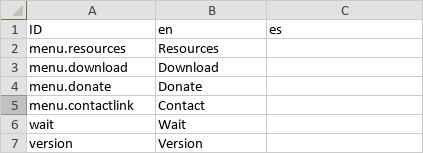

# JSON Translator Beta

A CLI app able to automatically translate a JSON file into any language or prepare a JSON file to be translated by a human translator into any language. Can be very useful if you need to generate JSON files with different translations from one with your project's default language.

  
  
  
## Features

- Can handle any JSON file, doesn't matter how deep it's hierarchy goes.
- Detects numbers, paths, filenames and urls and skip their translation.
- Help included in the CLI.
- Uses TSV (TAB separated file) files for the manual translation. These files are easily read by any spreadsheet application.
- Can have fields that preserve their values and don't get translated

  
  
  
## Prerequisites

This project requires NodeJS (version 8 or later) and NPM.
[Node](http://nodejs.org/) and [NPM](https://npmjs.org/) are really easy to install.
To make sure you have them available on your machine, try running the following command.

```sh
$ npm -v && node -v
6.4.1
v8.16.0
```

  
  
  
## Installation

```sh
$ npm install @wstaeblein/json-translator -g
```

  
  
  
## Usage and API

The app has 3 commands, plus you can execute it with no arguments or with --help to get on screen help. The commands and their arguments are explained below
  
  
### 1- TRANSLATE

This command performs the automatic translation using Google Translator. The idea here is to get a fast translation without the need for a translator. It is a good idea to either revise the translation or have someone revise for you. That's why you can your translation saved as a JSON or as a TSV.

You'll need to pass 5 arguments as shown below, none are optional.

```sh
$ jsontrans translate ./myfile-pt.json pt en json
```
The first argument is the command translate, the second is a path that points to a JSON file with it's contents in your original language. From this file the translate command will generate a new file with the same structure as the one passed but with the contents translated into your language of choice.

The third argument is the ISO language code of the file passed in the previous argument and the forth is the language you wish your file translated into. Last but not least, the fifth argument is the output format. It can be either JSON or TSV. 

If JSON is chosen, a JSON file with the translation is created. If TSV is chosen, a TSV file with columns for and identificator (internal use), the original language and the target language are created. This way you can provide a translator with a file that is already translated and need only a revision and possible corrections, making his/her job much easier.



*When tsv is the format, a file with a translation is generated*

The example above will translate myfile-pt.json from portuguese to english. That will generate a file in the same folder called myfile-pt-en.json. Should the name of the file be equal to it's language code, the resulting file will follow. That means that if we had a file called pt.json instead, the translated file would be en.json.

JSON keys that start with a double underscore '__' will not be translated. Instead of the translated text the field will contain the original text.

Fields that contain numbers don't get translated.
  
  
### 2- PREPARE

This command prepares a JSON file to be manually translated by a human or system. You'll need to pass 4 arguments as shown below, none are optional.

```sh
$ jsontrans prepare ./myfile-pt.json pt en
```

The first argument is the command prepare, the second is a path that points to a JSON file with your original translation. The third argument is the ISO language code of the file passed in the previous argument and the forth is the language you wish your file translated into.

This command will generate a TSV file in the same folder and with the same name as the one passed, but with a tsv extension. The file will have 3 columns as follows:

1- Dot notation of the field in the original JSON file.
2- The field's text in the original language
3- Empty column for the translation to be entered



*The TSV file looks like this*

The idea is to give this file to the translator and instruct him to type the translations in the third column. Needless to say that if someone tampers 

You'll need the original file to create a new JSON file with the translated text. That is done in the next command.
  
  
### 3- TRANSFORM

This command is used to transform a TSV file that has already been translated into a JSON file with the same structure as the file used to generate the TSV in the first place and the translated text. The TSV file must have been generated by this app.

```sh
$ jsontrans transform ./myfile.tsv /myfile.json newfilename
```

The 4 arguments are as follows. The first is the command transform, the second is the path to the TSV file, the third is the path to the original JSON file (the one used to create the TSV file for translation) and the last is the filename for the json file to be created.
  
  
### Observations

- The TSV extension indicates tab separated files, much like CSVs but instead of commas or semicolons TABs are used to separate cells.
- Existing files will be overwritten without warning.
- The TSV files generated by this app must not be changed. The translator must be instructed to make changes only to the third column with the appropriate translations and nothing else.
- The TSV files created by this app set the first line as a header. The first column is the Identificator, the second the original language and the third the target language.
- Transform command expects the TSV file's first line to be a header and will ignored it.
- You can open TSV files with a large number of applications, including Microsoft Excel (multiplatform) and OpenOffice Calc (multiplatform). 
- You can upload [TSV files](https://docs.fileformat.com/spreadsheet/tsv) to Google Sheets to view, edit, save, and convert the files.

  
  
  
## Author

**Walter Staeblein** 

  
  
  
## License

 This software is made available under the [Apache Licence 2.0](http://www.apache.org/licenses/LICENSE-2.0).